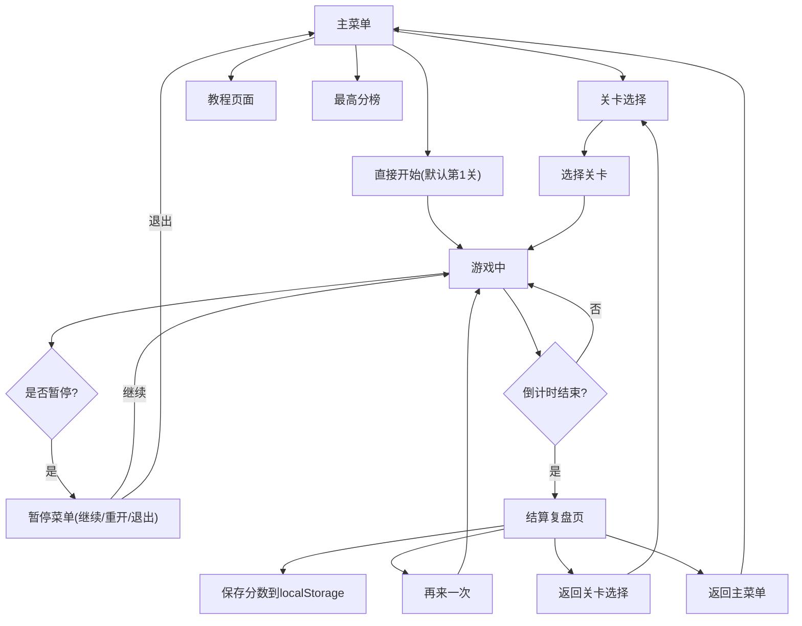

## 1. 产品概述

机场行李分拣节奏小游戏是一款单机休闲游戏，玩家扮演机场行李分拣员，在限定时间内将不断出现的行李卡片按照航班、重量等级和优先级送入正确的通道。游戏融合了节奏操作、策略选择和反应挑战，通过关卡递进和随机事件增加游戏深度与可玩性。

- 目标用户：休闲游戏玩家、喜欢节奏类/策略类小游戏的用户
- 核心价值：在快节奏的分拣操作中体验紧张刺激的游戏乐趣，通过策略性处理特殊事件获得成就感

## 2. 核心功能

### 2.1 用户角色

| 角色 | 注册方式 | 核心权限 |
|------|----------|----------|
| 玩家 | 无需注册，单机模式 | 游玩所有关卡、查看本地最高分、游戏设置 |

### 2.2 功能模块

1. **主菜单**：开始游戏、关卡选择、教程、最高分榜、退出
2. **关卡选择**：展示已解锁关卡、关卡难度星级、最高分、选择入口
3. **教程页面**：图文+交互演示游戏基本操作和规则
4. **游戏主界面**：行李生成区、通道列表、计时条、提示面板、分数显示、暂停按钮
5. **结算复盘页**：最终得分、各评分维度详情、失分原因、关键统计、返回按钮

### 2.3 页面详情

| 页面名称 | 模块名称 | 功能描述 |
|----------|----------|----------|
| 主菜单 | Logo与标题 | 游戏名称、副标题动画展示 |
| 主菜单 | 功能按钮区 | 开始游戏、关卡选择、游戏教程、最高分榜，带hover动效 |
| 关卡选择 | 关卡卡片网格 | 每个关卡显示名称、星级难度、最高分、锁定/解锁状态 |
| 游戏主界面 | 顶部状态栏 | 倒计时进度条、当前得分、暂停键、关卡编号 |
| 游戏主界面 | 行李生成队列 | 即将出现的行李预览、当前待分拣行李卡片 |
| 游戏主界面 | 通道列表区 | 航班号、登机口、重量限制、当前积压、快捷编号 |
| 游戏主界面 | 事件提示面板 | 临时改登机口、超重警报、航班截载、安检复核的横幅提示 |
| 游戏主界面 | 批量确认区 | 已分拣行李列表、一键确认按钮 |
| 结算复盘页 | 得分总览 | 最终分数、评级(S/A/B/C/D)、与历史最高分对比 |
| 结算复盘页 | 维度评分卡 | 分拣正确率、超重处理速度、航班截载完成率、错分次数、剩余时间的分项得分与满分 |
| 结算复盘页 | 失分原因列表 | 按时间顺序列出关键错误事件、扣分详情 |
| 结算复盘页 | 操作按钮 | 再来一次、返回关卡选择、返回主菜单 |

## 3. 核心流程

玩家从主菜单进入游戏，可以直接开始或选择关卡。游戏中行李卡片按节奏出现，玩家通过拖拽或快捷键将行李送入对应通道，处理超重行李和应对随机事件。倒计时结束或玩家主动暂停后进入结算页，查看成绩和失分原因，成绩自动保存到本地。

## 4. 用户界面设计

### 4.1 设计风格
- 主色：机场科技蓝 `#1E3A8A` 搭配警示橙 `#F97316`
- 辅助色：通行绿 `#10B981`、错误红 `#EF4444`、超重紫 `#8B5CF6`
- 背景：深空灰渐变 `#0F172A → #1E293B`，模拟机场夜景灯光氛围
- 卡片风格：玻璃拟态（Glassmorphism）+ 半透明毛玻璃效果，带柔和发光边框
- 按钮：圆角矩形（radius 12px），按压有3D下沉效果和辉光反馈
- 字体：标题使用 `Space Grotesk` 粗体，正文使用 `Inter` 常规字重
- 图标风格：`lucide-react` 线性图标，尺寸统一20px
- 动效：行李生成用弹入动画（spring），拖拽有吸附反馈，事件提示用滑入+呼吸光效

### 4.2 页面设计概览

| 页面名称 | 模块名称 | UI元素 |
|----------|----------|--------|
| 主菜单 | Hero区 | 大号游戏名「行李分拣大师」、动态传送带装饰、航班信息滚动条 |
| 主菜单 | 按钮区 | 4个带图标的主按钮，竖向排列，hover时左侧出现发光指示条 |
| 关卡选择 | 关卡卡片 | 4张卡片2x2网格，含关卡名、难度星数、历史最高分、解锁图标 |
| 游戏主界面 | 顶部计时条 | 渐变填充进度条，时间不足时闪烁红色，中间显示剩余秒数 |
| 游戏主界面 | 行李卡 | 圆角卡片，航班号大字、重量条颜色区分(绿/黄/红)、优先级徽章、拖拽把手 |
| 游戏主界面 | 通道列 | 竖向4列通道，顶部航班+登机口，中间接收槽，底部快捷数字键1-4 |
| 游戏主界面 | 事件横幅 | 顶部下方滑入，颜色区分事件类型，3-5秒后自动消失 |
| 结算复盘页 | 分数展示 | 大号最终分、星级评定、S/A/B/C/D评级徽章带光泽动效 |
| 结算复盘页 | 维度卡片 | 5张横向排列的进度条卡片，每项显示图标+名称+得分/满分 |
| 结算复盘页 | 失分原因 | 时间线样式列表，每行显示时间戳、事件类型图标、描述、扣分数值 |

### 4.3 响应式
- 设计优先级：桌面端优先（最小宽度1280px）
- 平板端（768-1024px）：通道改为2x2网格，行李卡尺寸缩小
- 移动端（<768px）：单列布局，通道改为横向滚动，行李卡改为点击选择模式
- 拖拽：桌面端支持HTML5 Drag & Drop，移动端降级为点击+确认操作

### 4.4 动效与交互
- 行李生成：从上方滑入 + 弹性缩放（spring: stiffness=300, damping=20）
- 拖拽过程：半透明跟随镜像，目标通道高亮发光
- 正确分拣：行李卡变绿 + √图标弹出 + 轻微粒子效果
- 错误分拣：红色抖动（shake动画3次）+ ×图标 + 扣分浮动文字
- 事件触发：横幅滑入 + 背景色呼吸闪烁 + 提示音（可选）
- 计时条：时间<10s时每秒闪烁红色脉冲动画
- 结算页：分数数字从0滚动到最终值，延迟递增
