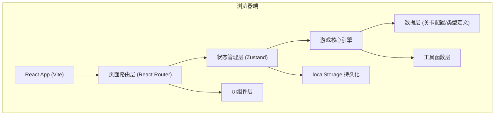

## 1. 架构设计

本游戏采用纯前端单页应用架构，所有数据和逻辑在客户端运行，使用 localStorage 进行本地持久化存储。



## 2. 技术选型说明

- 前端框架：React@18 + TypeScript
- 构建工具：Vite@5
- 样式方案：Tailwind CSS@3 + CSS Modules（可选）
- 状态管理：Zustand（轻量级、适合游戏状态）
- 路由：react-router-dom@6
- 图标：lucide-react
- 动画：Framer Motion（流畅的拖拽和过渡动画）
- 后端：无（纯前端单机游戏）
- 数据库：localStorage（存储最高分和游戏设置）

## 3. 路由定义

| 路由路径 | 页面组件 | 用途 |
|----------|----------|------|
| `/` | MainMenu | 主菜单页面 |
| `/levels` | LevelSelect | 关卡选择页面 |
| `/tutorial` | Tutorial | 教程页面 |
| `/game/:levelId` | GameBoard | 游戏主界面 |
| `/result/:levelId` | ResultPage | 结算复盘页面 |
| `/highscores` | HighScores | 最高分榜页面 |

## 4. 数据模型

### 4.1 核心类型定义

```typescript
// 航班信息
interface Flight {
  id: string;
  flightNo: string;          // 航班号，如 CA1234
  gate: string;              // 登机口，如 A12
  destination: string;       // 目的地
}

// 行李重量等级
type WeightLevel = 'light' | 'normal' | 'heavy' | 'overweight';

// 行李优先级
type PriorityLevel = 'normal' | 'express' | 'vip';

// 行李卡片
interface Baggage {
  id: string;
  flightId: string;          // 所属航班ID
  weight: number;            // 实际重量(kg)
  weightLevel: WeightLevel;
  priority: PriorityLevel;
  passengerName: string;     // 乘客姓名
  isSecurityChecked: boolean; // 是否已过安检
  createdAt: number;         // 生成时间戳
  assignedChannelId?: string; // 分配的通道
  status: 'pending' | 'processing' | 'sorted' | 'missed' | 'rejected';
}

// 分拣通道
interface Channel {
  id: string;
  flightId: string;          // 对应航班ID
  shortcutKey: string;       // 快捷键数字 1-4
  maxWeight: number;         // 最大重量限制
  capacity: number;          // 容量上限
  currentLoad: number;       // 当前装载量
  isBoarding: boolean;       // 是否正在登机
  boardingDeadline?: number; // 截载时间戳
  changedGate?: string;      // 临时改的登机口
}

// 事件类型
type EventType = 
  | 'gate_change'       // 临时改登机口
  | 'overweight_alert'  // 超重行李警报
  | 'early_boarding'    // 航班提前截载
  | 'security_recheck'; // 安检复核

// 游戏事件
interface GameEvent {
  id: string;
  type: EventType;
  title: string;
  message: string;
  relatedFlightId?: string;
  relatedBaggageId?: string;
  triggerTime: number;      // 触发时间(游戏内秒数)
  duration: number;         // 持续时间(秒)
  resolved: boolean;
  penalty?: number;         // 未处理扣分值
}

// 失分记录
interface MistakeRecord {
  id: string;
  time: number;             // 游戏内时间
  type: 'wrong_channel' | 'overweight_ignored' | 'missed_boarding' | 'security_failed' | 'baggage_expired';
  description: string;
  penalty: number;
  relatedBaggageId?: string;
  relatedFlightId?: string;
}

// 评分维度
interface ScoreBreakdown {
  accuracy: { score: number; max: number; rate: number };      // 分拣正确率
  overweight: { score: number; max: number; avgSpeed: number }; // 超重处理速度
  boarding: { score: number; max: number; completeRate: number }; // 截载完成率
  mistakes: { score: number; max: number; count: number };     // 错分次数
  timeBonus: { score: number; max: number; remaining: number }; // 剩余时间
}

// 结算数据
interface GameResult {
  levelId: string;
  totalScore: number;
  grade: 'S' | 'A' | 'B' | 'C' | 'D';
  breakdown: ScoreBreakdown;
  mistakes: MistakeRecord[];
  sortedCount: number;
  totalBaggageCount: number;
  playTime: number;          // 实际游戏时长(秒)
  timestamp: number;         // 完成时间戳
}

// 关卡配置
interface LevelConfig {
  id: string;
  name: string;
  description: string;
  difficulty: 1 | 2 | 3 | 4 | 5;  // 星级难度
  duration: number;          // 关卡总时长(秒)
  flights: Flight[];
  baggageSpawnRate: number;  // 行李生成间隔(ms)
  maxConcurrentBaggage: number; // 最大同时存在行李数
  overweightChance: number;  // 超重概率 0-1
  expressChance: number;     // 优先行李概率 0-1
  events: EventConfig[];     // 事件触发配置
  unlocked: boolean;         // 是否默认解锁
  unlockScore?: number;      // 解锁所需分数
}

// 事件配置
interface EventConfig {
  type: EventType;
  startTime: number;         // 最早触发时间(游戏秒数)
  endTime: number;           // 最晚触发时间
  probability: number;       // 触发概率
  minInterval: number;       // 最小间隔时间(秒)
}
```

### 4.2 localStorage 数据结构

```typescript
// 存储键名
const STORAGE_KEYS = {
  HIGH_SCORES: 'baggage_sort_high_scores',
  UNLOCKED_LEVELS: 'baggage_sort_unlocked_levels',
  GAME_SETTINGS: 'baggage_sort_settings',
};

// 最高分记录
interface HighScoreRecord {
  levelId: string;
  score: number;
  grade: string;
  timestamp: number;
}

// 游戏设置
interface GameSettings {
  soundEnabled: boolean;
  musicVolume: number;
  dragSensitivity: number;
}
```

## 5. 目录结构

```
src/
├── assets/                 # 静态资源（字体、图片等）
├── components/             # 可复用UI组件
│   ├── BaggageCard.tsx     # 行李卡片组件（可拖拽）
│   ├── ChannelColumn.tsx   # 通道列组件（可放置）
│   ├── TimerBar.tsx        # 计时进度条
│   ├── EventBanner.tsx     # 事件提示横幅
│   ├── ScoreDisplay.tsx    # 分数显示
│   ├── LevelCard.tsx       # 关卡选择卡片
│   ├── GradeBadge.tsx      # 评级徽章
│   ├── MistakeTimeline.tsx # 失分时间线
│   └── PauseModal.tsx      # 暂停弹窗
├── data/
│   └── levels.ts           # 关卡配置静态数据
├── hooks/
│   ├── useGameEngine.ts    # 游戏引擎Hook
│   ├── useDragDrop.ts      # 拖拽逻辑Hook
│   ├── useKeyboard.ts      # 快捷键Hook
│   └── useTimer.ts         # 计时器Hook
├── pages/
│   ├── MainMenu.tsx        # 主菜单
│   ├── LevelSelect.tsx     # 关卡选择
│   ├── Tutorial.tsx        # 教程页
│   ├── GameBoard.tsx       # 游戏主界面
│   ├── ResultPage.tsx      # 结算复盘
│   └── HighScores.tsx      # 最高分榜
├── store/
│   └── gameStore.ts        # Zustand全局状态
├── types/
│   └── index.ts            # 类型定义
├── utils/
│   ├── score.ts            # 评分计算
│   ├── baggage.ts          # 行李生成工具
│   ├── events.ts           # 事件系统
│   └── storage.ts          # localStorage封装
├── App.tsx                 # 应用入口
├── main.tsx                # React挂载点
└── index.css               # 全局样式+Tailwind
```

## 6. 游戏引擎核心逻辑流程

```
游戏启动
    ↓
加载关卡配置 → 初始化通道/航班 → 启动计时器
    ↓
[主循环 (requestAnimationFrame)]
    ├─ 检查是否到行李生成时间 → 生成新行李卡
    ├─ 检查事件触发条件 → 触发对应事件
    ├─ 更新倒计时 → 判断是否结束
    ├─ 检测行李超时未处理 → 记为失误扣分
    ├─ 更新通道状态（截载/容量等）
    └─ 监听玩家操作（拖拽/按键/确认）
        ├─ 行李正确分拣 → 加分，更新通道
        ├─ 行李错误分拣 → 扣分，记录失误
        ├─ 超重行李特殊处理 → 加分/扣分
        ├─ 航班截载处理 → 统计完成率
        └─ 安检复核处理 → 通过/拒绝
    ↓
倒计时归零 OR 玩家退出
    ↓
计算各维度得分 → 生成结算数据 → 保存localStorage
    ↓
跳转结算复盘页
```
